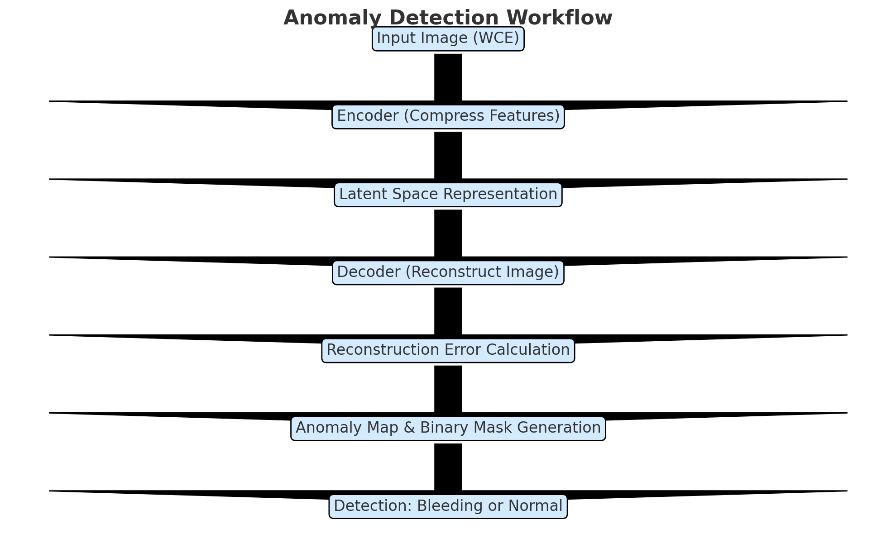
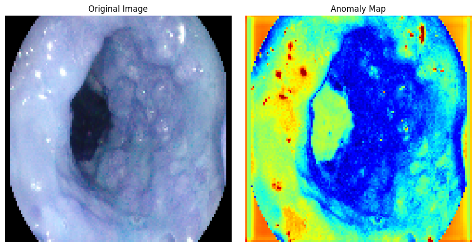
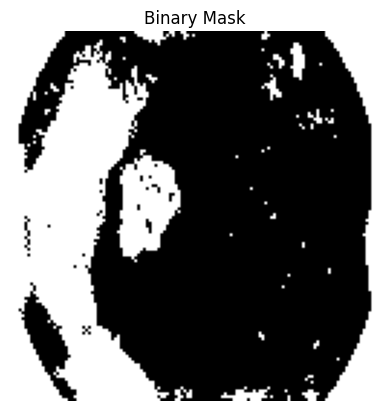
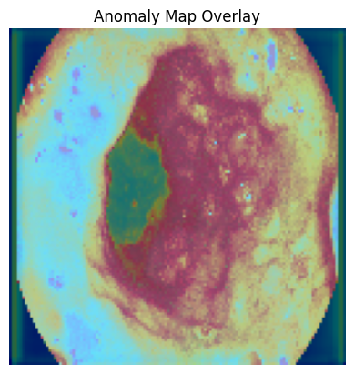

# Gastrointestinal-Bleeding-Anomaly-Detection-Using-Autoencoders
Anomaly Detection for Automated Identification of Gastrointestinal Bleeding in Wireless Capsule Endoscopy Images Using Autoencoders

---

## **Table of Contents**
1. [Abstract](#abstract)
2. [Key Objectives](#key-objectives)
3. [Methods](#methods)
   - [Data Collection](#data-collection)
   - [Autoencoder Model Development](#autoencoder-model-development)
4. [Anomaly Map and Localization](#anomaly-map-and-localization)
5. [Results](#results)
6. [Discussion](#discussion)
7. [Conclusion](#conclusion)
8. [Future Work](#future-work)
9. [License](#license)

---

## **Abstract**
Gastrointestinal (GI) bleeding is a critical condition that requires timely diagnosis and intervention. Wireless capsule endoscopy (WCE) has emerged as a valuable tool for visualizing the entire GI tract non-invasively, making it ideal for detecting GI abnormalities. However, the large volume of image data generated by WCE presents a challenge for manual review, often leading to delayed diagnoses or missed abnormalities. To address this, anomaly detection using machine learning techniques, particularly autoencoders, offers a promising solution. Autoencoders, trained exclusively on normal images, can effectively detect deviations from normal patterns, enabling automated identification of abnormalities such as GI bleeding or lesions. This study includes the generation of pixel-wise anomaly maps for enhanced visual interpretability, aiding clinicians in identifying regions of interest. Based on validation performance, an optimal threshold was selected to classify normal and bleeding images, ensuring reliable detection. The study achieved high sensitivity and accuracy, aligning with the objectives of minimizing false positives, maximizing sensitivity, and providing interpretable visual outputs to enhance clinical decision-making.

---

## **Key Objectives**
1. **Develop an autoencoder model** to identify bleeding or lesion images as anomalies using only normal images for training.
2. **Evaluate the effectiveness** of the anomaly detection approach in detecting GI bleeding, aiming to reduce false positives while maintaining high sensitivity.
3. **Investigate the potential** of using anomaly maps to locate bleeding areas within the image for added interpretability.

---

## **Methods**

### **Data Collection**
- **Dataset**: [Gastrointestinal Bleeding Images Dataset](https://www.kaggle.com/datasets/aryashah2k/gastrointestinal-bleeding-images-dataset).
- **Training Data**: Only normal WCE images were used for training.
- **Validation and Test Data**: Balanced datasets containing both normal and bleeding images were created to evaluate the model's performance.

---

### **Autoencoder Model Development**

#### Architecture
The autoencoder consists of an encoder-decoder structure:
- **Encoder**: Compresses input images into a low-dimensional latent representation, capturing essential features of normal WCE images.
- **Decoder**: Reconstructs the original image from the latent space, minimizing reconstruction error.

#### Visualization of Anomaly Detection Workflow

---

#### Training on Normal Images
- The autoencoder was trained exclusively on normal images to ensure it learned typical patterns in healthy WCE images.
- By avoiding exposure to bleeding images during training, the model could generalize well and treat anomalies as deviations from the learned patterns.

---

#### Anomaly Detection Mechanism
- **Reconstruction**: For each test image, the model reconstructed the image.
- **Reconstruction Error**: A pixel-wise reconstruction error was calculated between the input and reconstructed image.
- **Thresholding**: Based on validation performance, a threshold of 0.0057 was set:
  - Normal images: Mean reconstruction error ≈ 0.0011.
  - Bleeding images: Mean reconstruction error ≈ 0.0068.

---

## **Anomaly Map and Localization**

### **Anomaly Map**
- Pixel-wise differences between the input image and its reconstruction were calculated to highlight regions with high reconstruction errors.
- These maps provide a visual representation of abnormal areas.

#### Example of Anomaly Map

---

### **Binary Mask Generation**
- A binary mask was generated by applying the reconstruction error threshold to the anomaly map.
- High-anomaly regions (likely bleeding) were segregated from the rest of the image.

#### Binary Mask Example

---

### **Anomaly Map Overlay**
- The anomaly map was overlaid on the original image using a heatmap for enhanced interpretability.
- This allows clinicians to visualize bleeding regions directly on the anatomical image.

#### Example of Anomaly Map Overlay

---

## **Results**

### **Performance Metrics**
- **Precision**: 0.83 (minimized false positives, ensuring reliable identification of true anomalies).
- **F1-Score**: 0.90 (balanced trade-off between precision and sensitivity).
- **AUC-ROC**: 0.72 (fair discrimination between normal and bleeding images).

---

## **Discussion**

### **Effectiveness of Anomaly Detection**
- The autoencoder demonstrated strong performance in detecting GI bleeding.
- Anomaly maps provided interpretable visual outputs, highlighting the regions most likely to contain bleeding.

### **Insights from Anomaly Maps**
- Anomaly maps and binary masks effectively localized bleeding regions, offering insights into the extent and location of the anomaly.

---

## **Conclusion**
The autoencoder-based anomaly detection model effectively identifies GI bleeding in WCE images, achieving high sensitivity and reliable detection. The integration of anomaly maps enhances interpretability, making the model clinically useful for detecting subtle visual cues indicative of bleeding.

---

## **Future Work**
1. **Generalization**: Incorporate additional datasets with diverse GI bleeding cases to improve model robustness.
2. **Advanced Architectures**: Experiment with variational autoencoders and hybrid transformer-autoencoder models for enhanced detection.
3. **Clinical Integration**: Develop a user-friendly interface to deploy the model in real-world clinical settings, ensuring real-time anomaly detection.

---

## **License**
  
This dataset used in this project is licensed under the [Creative Commons Attribution-ShareAlike 4.0 International License](https://creativecommons.org/licenses/by-sa/4.0/).
